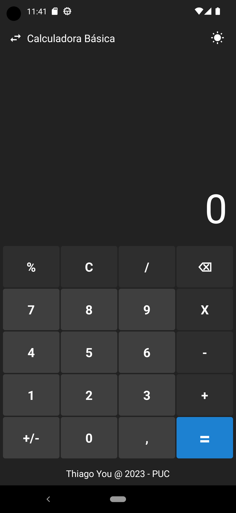
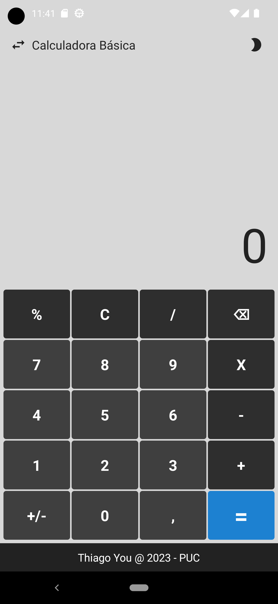
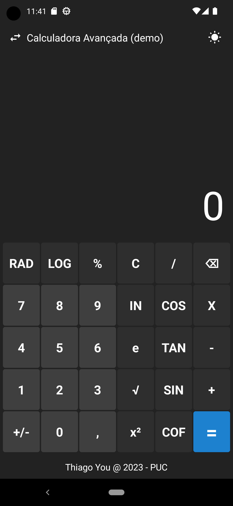
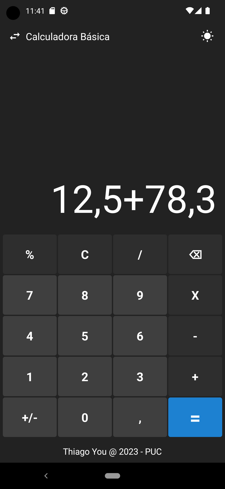
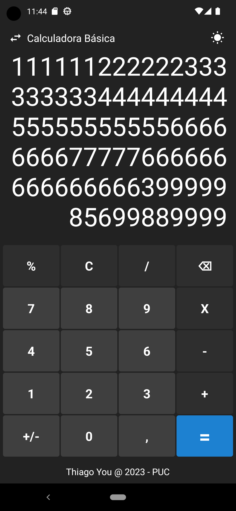

# Calculadora - PUCPR 2023
Calculadora básica para projeto da Pós PUCPR 2023.

### Funcionalidades
- Cálculos Básicos
- Tema Claro e Tema Escuro
- Visor numérico responsivo 
- Layout avançado (demonstração)
- Layout componentizado

### Demonstração
#### Tema Escuro
 

#### Tema Claro

#### Layout Avançado
 

#### Soma Básica

#### Tela Responsiva
